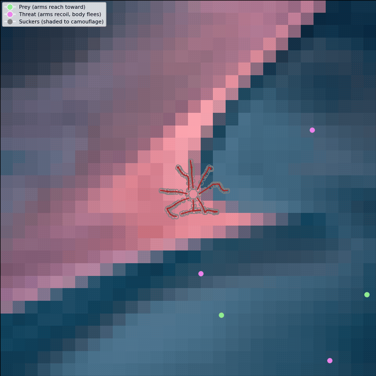
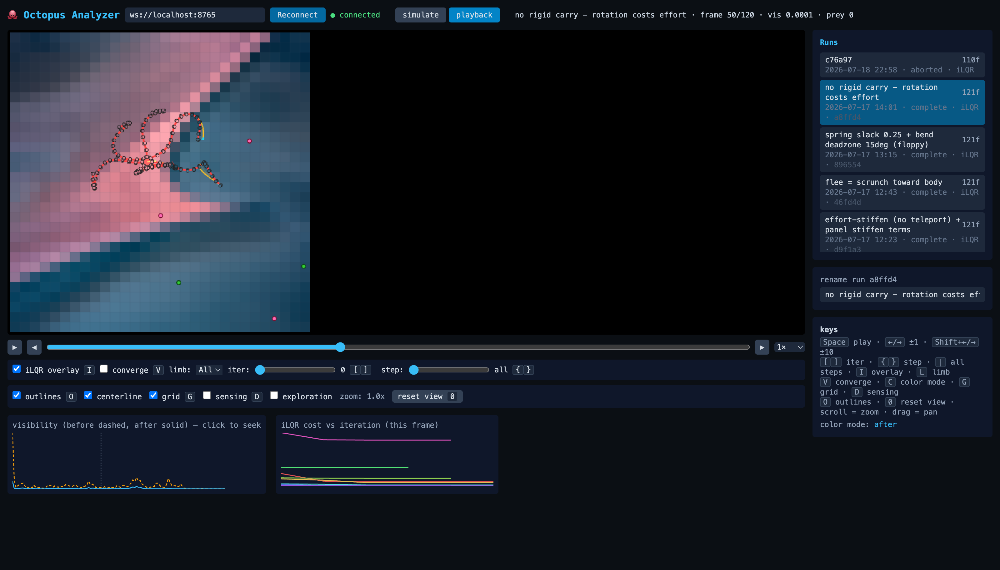
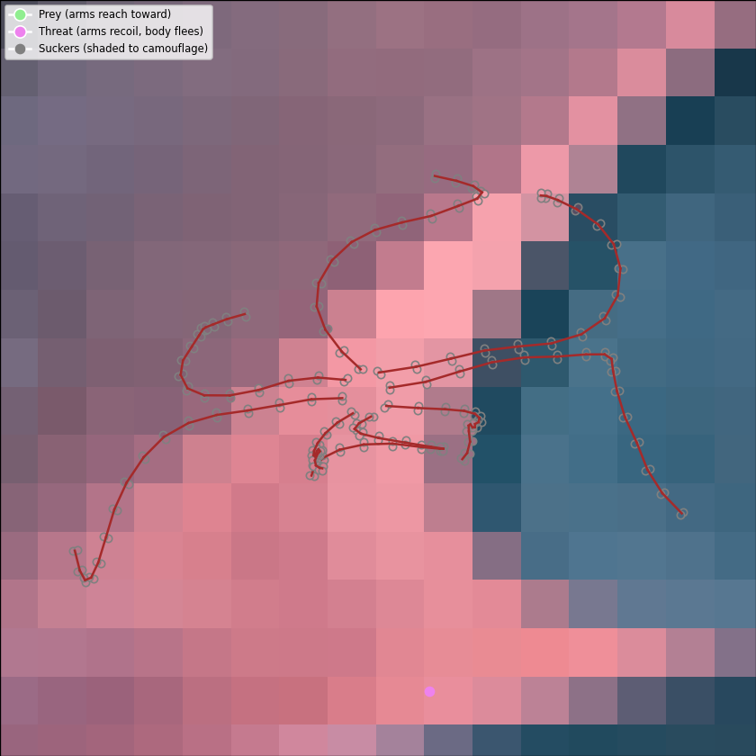
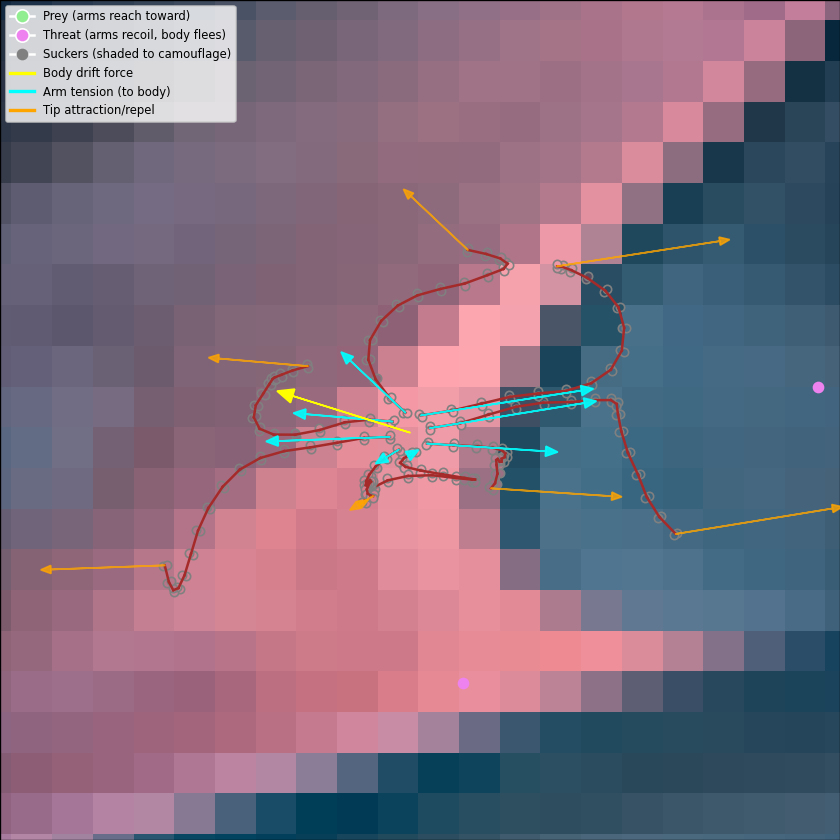
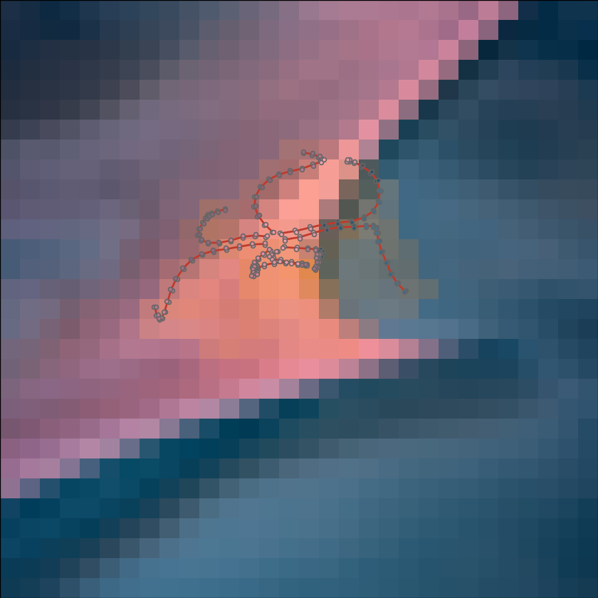
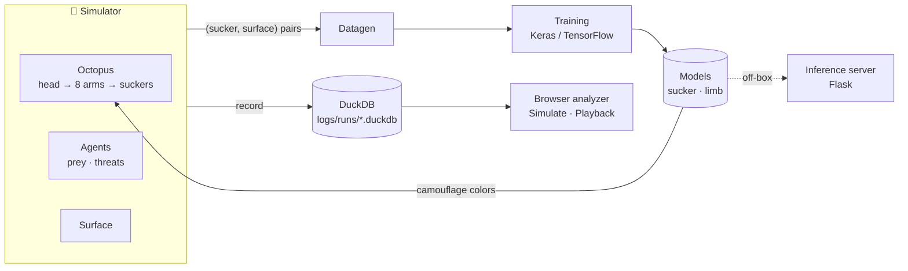
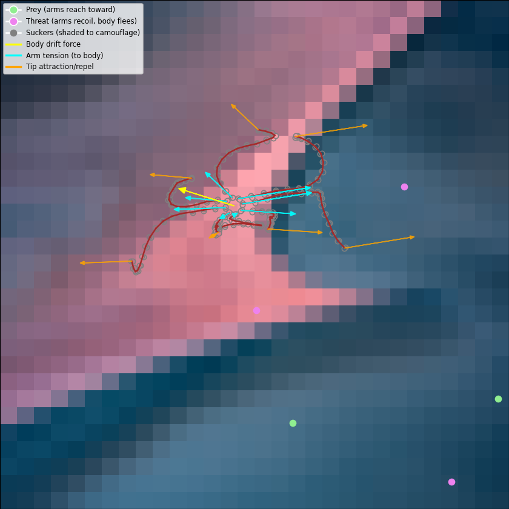
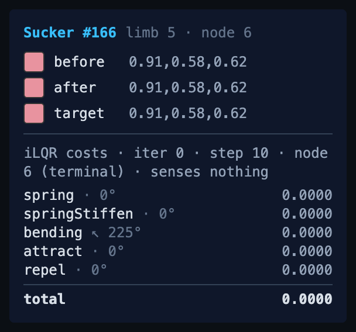
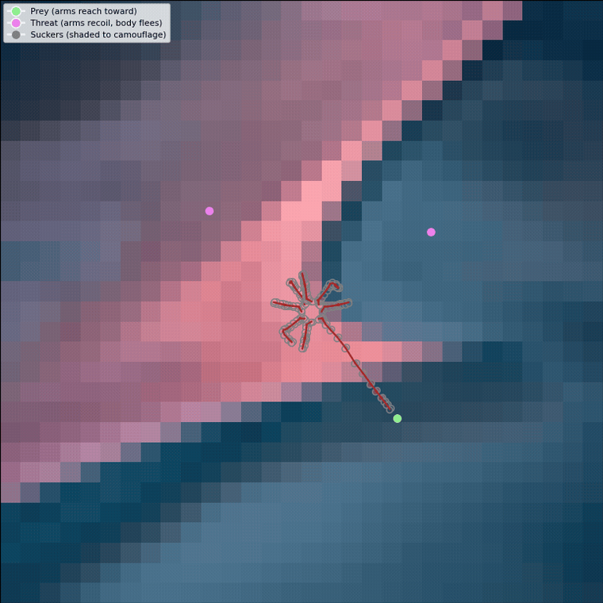

<div align="center">

# 🐙 octopus_ai

### A simulation + machine-learning sandbox for octopus **camouflage** and **motor control**

An octopus — head → 8 arms → a grid of suckers — crawls a 2D surface among prey and threats.
Its arms *reach, flee, and explore* under real-time trajectory optimization; its suckers
**camouflage**, matching the surface beneath them one constrained step at a time.

<!-- MEDIA: hero -->
<p align="center">
  
</p>


*More rambling at [davabrams.wordpress.com](https://davabrams.wordpress.com/)*

</div>

---

## ✨ Highlights

|   |   |
|---|---|
| 🎨 **Camouflage** | Each sucker matches the RGB surface beneath it, constrained to change ≤ 0.25 per channel per step — trained Keras models that "drift toward the target slowly." |
| 🤖 **Motor control** | In `ILQR` mode each arm runs its own compiled TensorFlow Gauss-Newton trajectory optimizer (MPC-style), re-planning every frame. |
| 🧭 **Node-autonomous sensing** | Every arm node independently *attracts* to nearby prey, *explores* unvisited cells, and *flees* threats by scrunching toward the body — no central controller. |
| 🐟 **Reactive agents** | Prey flee and threats pursue the nearest sucker; a well-camouflaged octopus can go unnoticed. |
| 🎞️ **Record & replay** | Headless runs record to DuckDB; a browser analyzer scrubs them frame-by-frame *and* iLQR-iteration-by-iteration. |
| 🔬 **Inspectable** | Hover any sucker or agent; watch per-node cost breakdowns, ghost horizon trajectories, and an exploration heatmap. |

---

## 🎬 See it in action

<!-- MEDIA: gallery (2×2) -->
<table>
  <tr>
    <td width="50%" align="center">
      <br>
      <sub><b>Browser analyzer</b> — scrub a recorded run, overlay iLQR plans</sub>
    </td>
    <td width="50%" align="center">
      <br>
      <sub><b>Camouflage</b> — suckers matching the surface, one step at a time</sub>
    </td>
  </tr>
  <tr>
    <td width="50%" align="center">
      <br>
      <sub><b>Motor control</b> — per-arm iLQR reach/flee; centerlines + force vectors</sub>
    </td>
    <td width="50%" align="center">
      <br>
      <sub><b>Exploration</b> — recency heatmap of where the suckers have been</sub>
    </td>
  </tr>
</table>

---

## 🧠 How it works

Two independent tiers ride on one simulator: **motor control** moves the arms and body,
**camouflage** colors the suckers. Data recorded from the sim trains the color models; a
browser analyzer replays it.



- **Simulator** (`simulator/`) — a 6-DOF kinematic octopus (head at `(x, y, θ)` → 8 `Limb`s →
  `16×2` `Sucker`s each, 256 total), a random or image-backed surface, and prey/threat agents.
- **Motor tier** — `MovementMode.ILQR`: each limb is a chain of nodes; every free node senses
  agents in its own window and contributes a per-node cost (attract / flee / spring / bend /
  effort). The body drifts and rotates from the summed arm tension — hunting and fleeing
  *emerge*, with no body-level agent sensing.
- **Camouflage tier** — each sucker computes a target color and steps toward it within the
  per-channel change cap, via a heuristic (`NO_MODEL`) or a trained model (`SUCKER` / `LIMB`).
- **Record & replay** — `simulator/headless_runner.py` steps a headless sim and writes one
  DuckDB file per run; `visualizer/analyzer.html` (served by `websocket_server.py`) plays it back.

Deep module-by-module reference lives in **[ARCHITECTURE.md](ARCHITECTURE.md)**.

---

## 🚀 Quickstart

[Bazel](https://bazel.build) is the primary build/run/test interface — the polyglot bet, so
pieces can move to C++/Rust/JS behind the same `bazel run` commands later. Today all the code
is Python, and **Bazel borrows your venv's interpreter and packages** (it does *not* manage the
Python deps), so create the venv first either way:

```bash
/opt/homebrew/bin/python3.12 -m venv .venv   # any Python ≥ 3.10 works
source .venv/bin/activate
pip install -e ".[dev]"

python -c "import tensorflow as tf; print(tf.__version__)"   # sanity check
```

> [!TIP]
> Always `source .venv/bin/activate` before running anything — both `bazel` and the raw
> `python` fallbacks use that interpreter. Apple-Silicon TensorFlow gotchas are in
> **[TRAINING.md](TRAINING.md)**.

**No trained model yet?** Run the heuristic first: set `inference.mode = MLMode.NO_MODEL`
(the `DEFAULT` profile expects a `SUCKER` model on disk).

---

## ▶️ Running things

Commands lead with Bazel; the raw `python …` form is an interchangeable fallback. `bazel run`
reads/writes artifacts (datasets, models) in the repo's `training/` tree — not the sandbox — so
a dataset generated one way is picked up by the other. (`bazel test` stays hermetic.)

### Watch it live (matplotlib)

```bash
bazel run //visualizer:octo_viz      # or: python visualizer/octo_viz.py
```

Needs a GUI session — click the window and press a key to start. The number is the
**visibility score** (mean squared color error; lower = better camouflage).

<!-- MEDIA: matplotlib -->
<p align="center">
  
</p>

### Record & replay (browser analyzer)

```bash
# 1) record a run headlessly → logs/runs/<run_id>.duckdb
python simulator/headless_runner.py --frames 120 --explore

# 2) launch the analyzer, then open http://localhost:8765/ in a browser
bazel run //visualizer:websocket_server   # or: python visualizer/websocket_server.py
```

**Simulate** runs a fresh headless sim and watches it record; **Playback** scrubs a saved run
frame-by-frame — and, for iLQR runs, iteration-by-iteration within a frame: ghost horizon poses,
convergence curves, per-node cost panels, and before/after camouflage colors. Toggle sucker/agent
outlines, the exploration overlay, and the iLQR overlay; hover a sucker or an agent to inspect it.

<!-- MEDIA: analyzer-detail (side by side: cost panel + pursuit/flee) -->
<table>
  <tr>
    <td width="50%" align="center">
      <br>
      <sub>Per-node iLQR cost breakdown with force directions</sub>
    </td>
    <td width="50%" align="center">
      <br>
      <sub>Threats pursue, prey flee, the octopus scrunches away</sub>
    </td>
  </tr>
</table>

### Generate data · train · serve

```bash
# Generate training data → training/datagen/sucker.pkl
bazel run //octopus_ai:datagen           # or: python octopus_ai/datagen.py

# Full pipeline: datagen → train → save  (→ training/models/{sucker,limb}.keras)
bazel run //octopus_ai:model             # or: python octopus_ai/model.py

# Training curves
tensorboard --logdir models/logs/sucker/fit/

# Inference server (loads the sucker model; runs off-box)
bazel run //inference_server:server      # http://localhost:8080
curl -X POST http://localhost:8080/jobs \
  -H "Content-Type: application/json" \
  -d '{"job_id": 1, "data": {"c.r": 0.5, "c_val.r": 1.0}}'
curl http://localhost:8080/jobs/1        # fetch result
```

The training walkthrough is in **[TRAINING.md](TRAINING.md)**; the server API in
**[ARCHITECTURE.md](ARCHITECTURE.md) §7**.

---

## ⚙️ Configuration

Config is a tree of **frozen dataclasses** — the schema is the source of truth in
[octopus_ai/config_schema.py](octopus_ai/config_schema.py), and
[octopus_ai/config.py](octopus_ai/config.py) builds named **profiles** from it. You never edit
shared state; you *select a profile* (or derive a variant with `dataclasses.replace()`).

<details>
<summary><b>Profiles</b> — pick one, don't edit shared state</summary>

<br>

| Profile | For |
|---------|-----|
| `DEFAULT` | shipped baseline; writes nothing to disk |
| `VIZ` | watching a run — force arrows on, disk quiet |
| `VIZ_ILQR` | the iLQR motor demo over an image background |
| `DEBUG` | everything on — arrows + force log + PNG/MP4 capture |
| `RECORD` | headless record & replay (writes a DuckDB run + iLQR history) |
| `TEST` | deterministic, side-effect free, needs no model on disk |
| `DATAGEN` | data generation (saves a dataset, no rendering) |
| `TRAINING` | the training pipeline |

</details>

Each entry script picks a profile on one line near the top (e.g. `CFG = …`). Derive a variant
without touching the shared config:

```python
from dataclasses import replace
from octopus_ai.config import VIZ_ILQR
from simulator.simutil import MLMode

# Watch the iLQR octopus, driven by the trained SUCKER camouflage model:
CFG = replace(VIZ_ILQR, inference=replace(VIZ_ILQR.inference, mode=MLMode.SUCKER))
```

Access is attribute-style everywhere: `cfg.world.x_len`, `cfg.octopus.num_arms`,
`cfg.octopus.limb.ilqr.w_repel`.

<details>
<summary><b>Knobs worth knowing</b></summary>

<br>

| Where | Knob | Does what |
|-------|------|-----------|
| `cfg.run` | `num_iterations` | frames to simulate (`-1` = forever) |
| `cfg.world` | `x_len` / `y_len` | surface grid size |
| | `background_image` / `surface_grayscale` | image surface vs. random noise |
| `cfg.agents` | `count` | number of prey/threat agents |
| | `movement_mode` | `RANDOM`, `PURSUIT_FLEE` (chase/flee in the sense window), or the visibility-gated spring modes |
| `cfg.octopus` | `num_arms` | limbs |
| | `movement_mode` | `RANDOM`, `LUMPED_SPRING`, `SPRING_CHAIN`, or **`ILQR`** |
| `cfg.octopus.limb` | `rows` / `cols` | suckers per limb |
| `cfg.octopus.sucker` | `max_hue_change` | max color change per step per channel |
| `cfg.octopus.limb.ilqr` | `w_reach_terminal` / `w_repel` | attract-to-prey / flee-from-threat strength |
| | `explore_enabled` | draw idle nodes toward unvisited cells |
| | `w_spring` / `w_bend` / `w_effort` | arm coherence terms (+ super-linear `*_stiffen` variants) |
| `cfg.inference` | `mode` / `model` | how colors are computed: `NO_MODEL`, `SUCKER`, `LIMB` |
| `cfg.training` | `ml_mode`, `epochs`, `batch_size`, `test_size` | training config |

The full set (with every iLQR / exploration knob) is in
[config_schema.py](octopus_ai/config_schema.py).

</details>

---

## 🧪 Testing & linting

```bash
python run_tests.py                  # all tests (preferred)
python run_tests.py --coverage       # with coverage
python run_tests.py --test test_kinematics.py
bazel test //tests/...               # hermetic alternative

make lint       # ruff check .
make format     # ruff format .
```

Per-file coverage notes are in **[tests/README.md](tests/README.md)**.

---

## 📚 Going deeper

| Doc | What's in it |
|-----|--------------|
| **[ARCHITECTURE.md](ARCHITECTURE.md)** | module-by-module reference, data flow, APIs |
| **[TRAINING.md](TRAINING.md)** | detailed training/inference workflows + env setup |
| **[CLAUDE.md](CLAUDE.md)** | conventions, commands, and known gotchas |
| **[tests/README.md](tests/README.md)** | per-file test coverage |

## 🚧 Current limitations

- Four limb movement modes work (`RANDOM`, `LUMPED_SPRING`, `SPRING_CHAIN`, `ILQR`); agents
  implement `RANDOM`, `PURSUIT_FLEE`, and the reactive spring modes.
- The `LIMB` camouflage pipeline is experimental; `SUCKER` is the solid path.
- `MLMode.FULL` is a placeholder — no model, dataset, or trainer yet.
- Inference always runs locally; the Flask server exists but nothing routes the simulator to it
  automatically.
- The analyzer frontend loads React/Babel/Tailwind from a CDN, so it needs internet on first
  load; vendoring is a known follow-up.

<div align="center">
<br>

### Why?

*I don't know, but I can't stop.* 🐙

</div>
